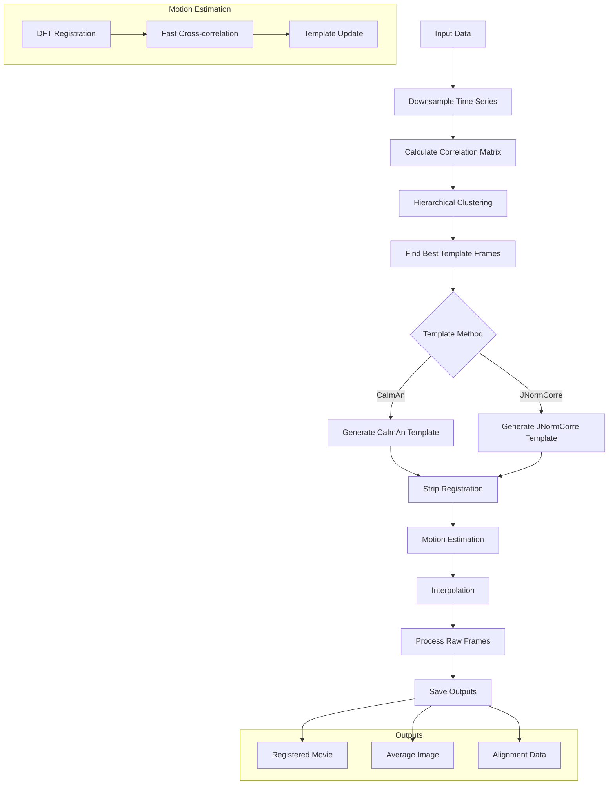

# iGluSnFR-registration

This capsule implements a robust motion correction pipeline for iGluSnFR imaging data, with support for either CaImAn or JNormCorre for initial template generation. The pipeline includes time-series downsampling, correlation-based template frame selection, strip-wise registration, and parallel processing for efficient computation, producing motion-corrected movies along with detailed alignment metrics and channel-specific average images.

# Usage:
```
python run_capsule.py \
    --input /path/to/tiffs \
    --output /results \
    --maxshift 50 \
    --ds_time 3 \
    --caiman_template True
```

# Outputs
```
results/simulation_description/
├── *_registered.tif          # Motion-corrected video
├── *_alignment_data.h5       # Shift vectors & metrics
└── *_channel_avg_8bit.tif    # Diagnostic average image
```

_alignment_data.h5 contains h5 file:
- `aData/numChannels`: The number of channels in the dataset.
- `aData/frametime`: The frame rate of the registered movie.
- `aData/motionR`: The values used to motion correct across the Y axis.
- `aData/motionC`: The values used to motion correct across the X axis.
- `aData/aError`: Alignment error.
- `aData/aRankCorr`: Rank correlation data.
- `aData/motionDSc`: The downsampled values used to motion correct across the X axis.
- `aData/motionDSr`: The downsampled values used to motion correct across the Y axis.
- `aData/recNegErr`: Negative reconstruction error metrics

# In-vivo tifs:
|  |  |
|:--------------------------------------------------------:|:-------------------------------------------------------:|
| Invivo movie before motion correction           | Invivo movie after motion correction                   |


# Registeration flowchart:

