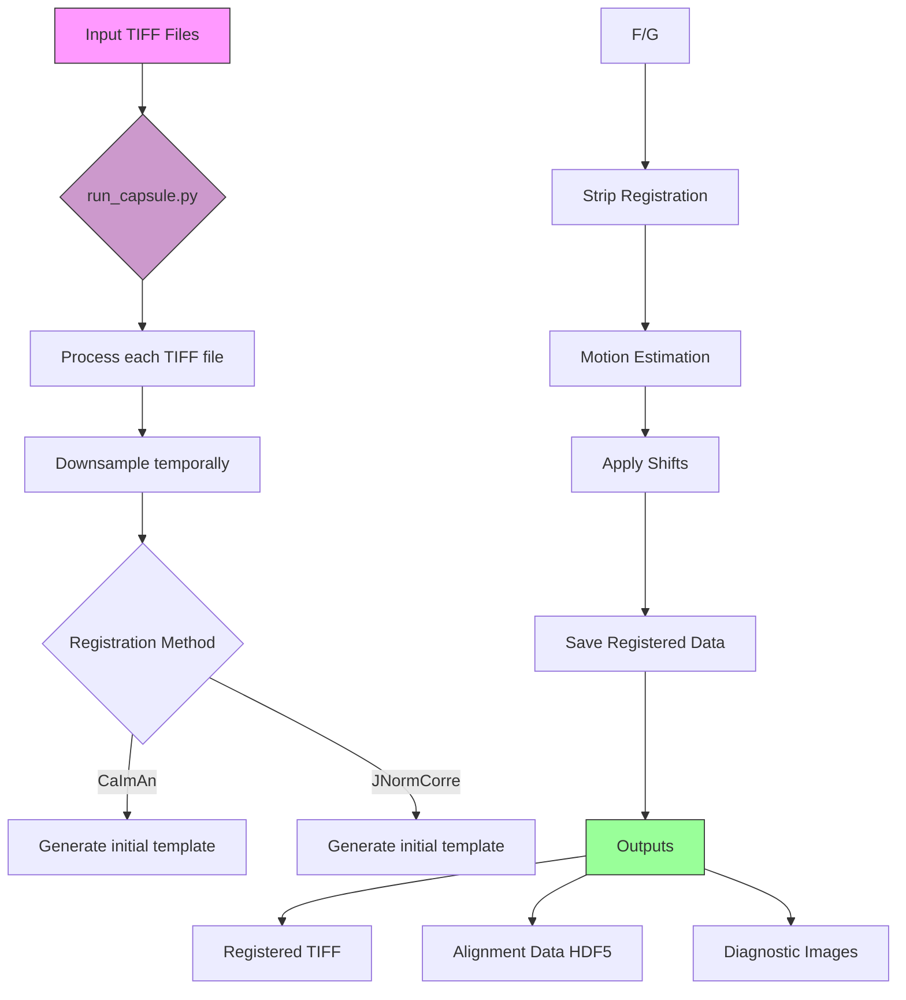

# iGluSnFR-registration

This capsule does registration for iGluSnFR data.

```mermaid
%% Flowchart for Motion Correction Pipeline
graph TD
    A[Input TIFF Files] --> B{run_capsule.py}
    B --> C[Process each TIFF file]
    C --> D[Downsample temporally]
    D --> E{Registration Method}
    E -->|CaImAn| F[Generate initial template]
    E -->|JNormCorre| G[Generate initial template]
    F/G --> H[Strip Registration]
    H --> I[Motion Estimation]
    I --> J[Apply Shifts]
    J --> K[Save Registered Data]
    K --> L[Outputs]
    L --> M[Registered TIFF]
    L --> N[Alignment Data HDF5]
    L --> O[Diagnostic Images]
    
    style A fill:#f9f,stroke:#333
    style B fill:#c9c,stroke:#333
    style L fill:#9f9,stroke:#333
```
